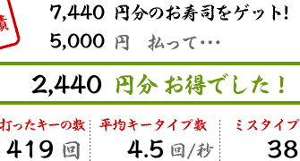

# sushi (頓挫)

### 実装したかったこと
- 以下の画像(寿司打)から各数字を抽出してCSVファイルに吐き出し、自分のタイピング速度を可視化するスクリプトの実装

### 用いた技術
- `Tesseract`と`Python3.6.5`

- そもそも `Tesseract` とはオープンソースのOCRのことである。
- `OCR(Optical Character Recognition / Reader) (光学的文字認識)` とは、手書きや印刷された文字を、イメージスキャナやデジタルカメラによって読みとり、コンピュータが利用できるデジタルの文字コードに変換する技術。これを利用すれば、画像から数字を抽出できると推測した。
