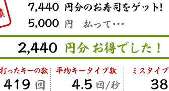

# sushi


### 実装したかったこと
- 以下の画像(寿司打)から各数字を抽出してCSVファイルに吐き出し、自分のタイピング速度を可視化するスクリプトの実装



- 具体的に言うと、この画像から 7440 5000 2440 419 4.5 38 を抽出したい。

### 用いた技術
- `Tesseract`と`Python3.6.5`

- そもそも `Tesseract` とはオープンソースのOCRのことである。
- `OCR(Optical Character Recognition / Reader) (光学的文字認識)` とは、手書きや印刷された文字を、イメージスキャナやデジタルカメラによって読みとり、コンピュータが利用できるデジタルの文字コードに変換する技術。これを利用すれば、画像から数字を抽出できると推測した。
- 内部の実装には従来の認識エンジンに加え、LSTMベースのニューラルネットワークによる認識エンジンが搭載されている。


### 試行錯誤
- 上述の枠の大きさの画像と、各数字を切り抜いた六枚の画像に２パターンの画像サイズの形式でtesseractコマンドで解析した。

- 実装においては、tesseractコマンドを直接叩く方法とtesseractのPythonのラッパーの`pyocr`を用いてみた。


### 結果
- このライブラリのアルゴリズムは画像から内部の学習データを元にテキストを生成するので、表示される値によって変換後のテキストに散らばりがある。この後処理が多くのパターンがあるので、処理が面倒だった。
- 後処理の対象は以下のものである。

```bash
pictures [master]$ python a.py 
['g', '7,060', 'AbhotA4T€7', '7', 'M\n5,000', 'M', '&oT\n\n2,060', 'MA', 'H44C', 'L/', '!\n\nlrokiA—olk:', 'B9X', '—', '9', '4', '7k', 'i2b', '47\n393', '©', '4.2', 'a/i', '49']
pictures [master]$ python a.py 
['g', '7440', 'AbhotAT€Z', '>', 'M\n5,000', 'M', '&oT\n2440', 'Mb', 'Bi¥CLA!\n\nlrokiA—olk:', 'B9X', '—', '9', '4', '7k', 'i2b', '47\n401', '®', '4.3', 'a/#', '62']
pictures [master]$ python a.py 
['fl', '210', 'AbhotkAkAI€7', '>', 'N\n5,000', 'M', '&oT\n\n4,760', 'MAkAMCLA\n\nlohk—ol|', 'HbX—#47i', '|', 'i2947\n\n19', '0.2', 'a/#', '1']
pictures [master]$ python a.py 
['g', '7,620', 'AhotAT€Z', '>b\n5,000', 'M', '&oT\n\n2,620', 'MA4', 'HitCLA', '!\n\nlrokiA—olk:', 'B9X', '—', '9', '4', '7k', 'i2b', '47\n400', '©', '4.3', 'a/#', '48']
pictures [master]$ python a.py 
['g', '6,900', 'Ahok4€77', 'M\n5,000', 'M', '&oT\n\n1,900', 'MA', 'BC', 'LA', '!\n\nlrokiA—olk:', 'B9X', '—', '9', '4', '7k', 'i2b', '47\n378', '©', '41', 'a/#', '71']
pictures [master]$ python a.py 
['g', '7,080', 'AbhotAT€7', '>', 'M\n5,000', 'M', '&oT\n\n2,080', 'M4', 'H44C', 'L/', '!\n\nlrokiA—olk:', 'B9X', '—', '9', '4', '7k', 'i2b', '47\n389', '©', '4.2', 'a/i', '58']
pictures [master]$ python a.py 
['g', '6,700', 'Abho#4T€7', '7', 'M\n5,000', 'M', '&oT\n\n1,700', 'MA', 'BC', 'LA', '1\n\nlrokiA—olk:', 'B9X', '—', '9', '4', '7k', 'i2b', '47\n386', '®', '41', 'a/#', '30']
```

- 例えば画像では4.1と描画されているのに41と認識されたり、目的の値がある箇所の余分な文字列をいかに省くかが煩わしかった。

- 現時点の自分のレートには対応できるよになっているが、今後細かい修正が必要になってくると思われる。

- また、各数字を切り抜いた手法(tesseractコマンド)を用いると、dpiの値の関係で数字を認識させるのが難しかった。

### ところが ...
- どうしても後処理の実装が納得行かなかったので、最後の最後にpyocrを用いて欲しい値の箇所の画像6枚を切り取った部分を解析すると、なんと上手くいってしまった。天才いやアホすぎた。以上。1ミリ成長。


### 次回以降の課題
- 対応レートの範囲を広げる
- dockerを使って再度真っさらな環境でリトライしてみる ???
- csvから可視化する機能の実装


### 参考資料
- [tesseractコマンドの使い方（Tesseract OCR 4.x）](http://blog.machine-powers.net/2018/08/02/learning-tesseract-command-utility/)

- [PyOCRでTesseractを使う ](http://blog.machine-powers.net/2018/08/04/pyocr-and-tips/)
